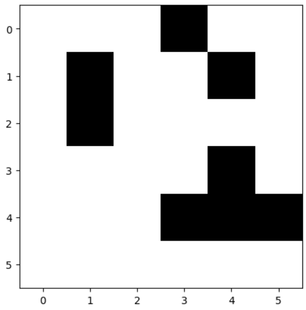
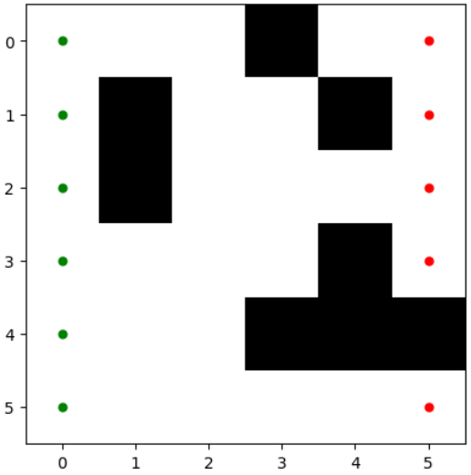

# GA Find Percolation

**Project Description:**  
This project is part of the Optimization (OP) class of the BI Master program at ICA PUC-Rio. The objective of the project is to use a genetic algorithm (GA) to evaluate whether a given porous media percolates or not. To accomplish this, a maze is created to simulate the porous media, and a maze solver is implemented using the GA.

The project starts with a single start and a single endpoint in the maze, representing the initial configuration of the porous media. The GA is then used to find an optimal path from the start to the endpoint, determining if percolation occurs. The aim is to expand the project to handle multiple start and endpoint configurations in the future.

**Language:**  
Python

**Authors:**  
[Vinicius Mattoso](https://www.linkedin.com/in/vinicius-mattoso/)  
<!-- [Author 2 Name](link-to-author2-github-profile) -->

## Installation

1. Copy the google colab file to your drive:
   

2. Follow the steps of the code:

3. Enjoy

## Results

Include a brief summary of the project's results and findings.

## Screenshots
1. Example of a maze to simulate a porous media, in black is the rigid media and in white is the open path

2. Example of a maze with the starts and ends points, in green and red respectively.

<!--  -->

## Contributing

We welcome contributions to enhance the project! To contribute:

1. Send me a mensage or an email:

https://www.linkedin.com/in/vinicius-mattoso/

vmatoso@lmmp.mec.puc-rio.br

## Future plans

1. Update the code tho be a entire python file:

2. Create the enviroment requirements:

3. Create a tkinter window where the client load an image, or set the maze parametrs

## License

This project is licensed under the [MIT License](LICENSE).
