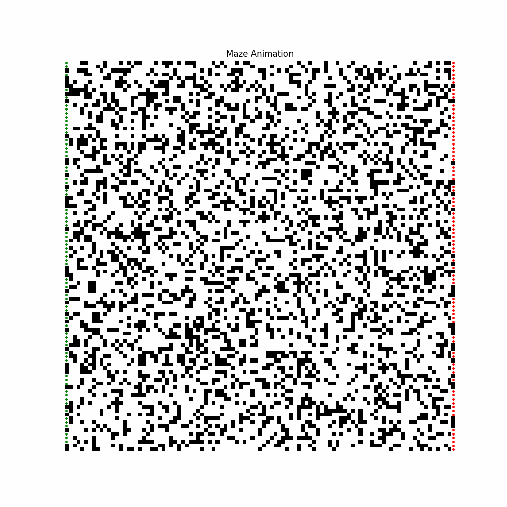
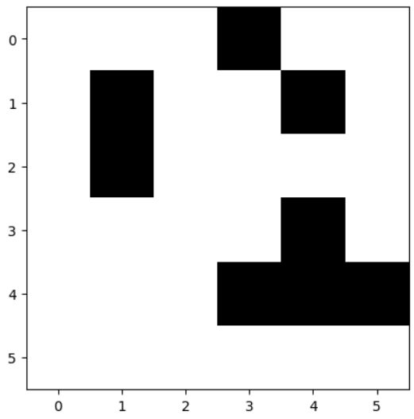
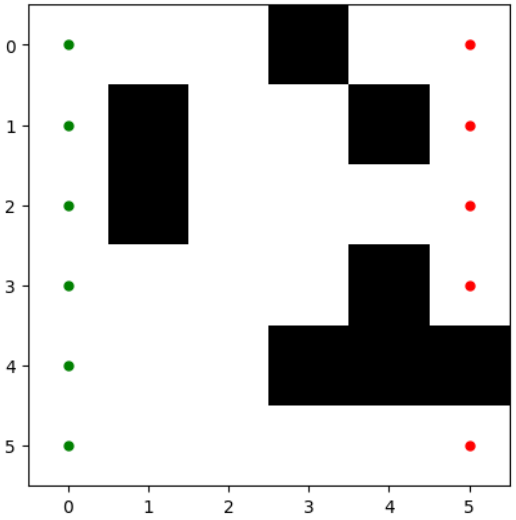
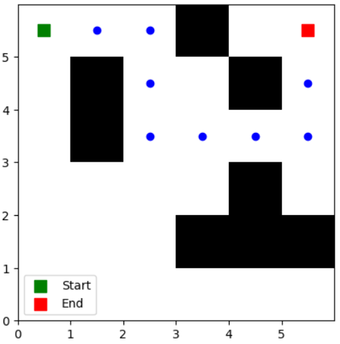

# Genetic Algorithm for Percolation in Porous Media  

---

## 🇺🇸 English Version

## 📌 Overview

This project explores the application of **Genetic Algorithms (GA)** to solve a **percolation problem in porous media**, commonly found in engineering fields such as **Oil & Gas, reservoir simulation, and materials science**.

Originally developed as part of the **BI Master Program (ICA PUC-Rio)**, this work preserves its academic foundation while being positioned as an **applied optimization problem** connecting theory and real-world systems.

---
## 🖼️ Visualization



---
## 🧠 Problem Description

Percolation in porous media refers to the ability of a fluid to flow through a network of interconnected pores.

Applications include:

- Reservoir engineering (fluid flow in rock formations)
- Oil recovery optimization
- Material permeability analysis
- Network connectivity problems

---

## ⚙️ Approach

This project applies a **Genetic Algorithm**:

- Grid-based representation of porous media
- Fitness function based on percolation behavior
- Selection, crossover, mutation
- Iterative optimization

---

## 🧪 Methodology

1. Initialize population  
2. Evaluate fitness  
3. Selection  
4. Crossover & mutation  
5. Convergence  

---

## 📊 Results

The algorithm demonstrates:

- Efficient exploration of complex search spaces    
- Approximation of optimal configurations  

---

## 🛠️ Tech Stack

- Python  
- NumPy  
- Matplotlib  
- Jupyter Notebook  

---

## ▶️ How to Run

```bash
git clone https://github.com/vinicius-mattoso/GA_find_percolation.git
cd GA_find_percolation
jupyter notebook
```

---

## 📁 Project Structure

```text
GA_find_percolation/
│
├── notebook.ipynb
├── assets/ (images/gifs)
└── README.md
```

---

## 🎓 Academic Context

This project is part of the **Optimization (OP) class** of the  
**BI Master Program at ICA PUC-Rio**.

---

## 🚀 Key Takeaways

- Applied Genetic Algorithms  
- Engineering-based problem solving  
- Optimization in physical systems  
- Strong relevance to Oil & Gas  

---

## 🔗 Future Improvements

- Performance improvements  
- Visualization enhancements  
- 3D extension  
- Benchmark vs other methods  

---

## 👤 Author

Vinicius Mattoso  
Data Scientist | AI, Optimization & Generative AI  

- GitHub: https://github.com/vinicius-mattoso  
- LinkedIn: https://www.linkedin.com/in/vinicius-mattoso/

---

# Algoritmo Genético para Percolação em Meios Porosos
---
## 🇧🇷 Versão em Português

## 📌 Visão Geral

Este projeto explora a aplicação de **Algoritmos Genéticos (GA)** para resolver um problema de **percolação em meios porosos**, com aplicações em **Oil & Gas, simulação de reservatórios e ciência dos materiais**.

Desenvolvido como parte do **BI Master (ICA PUC-Rio)**, preserva sua base acadêmica com foco em **otimização aplicada**.

---

## 🖼️ Visualização


---

## 🧠 Descrição do Problema

Percolação refere-se à capacidade de um fluido atravessar uma rede de poros interconectados.

Aplicações:

- Engenharia de reservatórios  
- Recuperação de petróleo  
- Permeabilidade de materiais  
- Conectividade em redes  

---

## ⚙️ Abordagem

Uso de **Algoritmo Genético**:

- Representação em grid  
- Função de fitness baseada na percolação  
- Seleção, crossover e mutação  
- Otimização iterativa  

---

## 🧪 Metodologia

1. Inicialização  
2. Avaliação  
3. Seleção  
4. Reprodução  
5. Convergência  

---

## 📊 Resultados

- Exploração eficiente   
- Aproximação do ótimo  

---

## 🛠️ Tecnologias

- Python  
- NumPy  
- Matplotlib  
- Jupyter  

---

## ▶️ Execução

```bash
git clone https://github.com/vinicius-mattoso/GA_find_percolation.git
cd GA_find_percolation
jupyter notebook
```

---

## 🎓 Contexto Acadêmico

Projeto da disciplina de **Otimização (OP)** do  
**BI Master – ICA PUC-Rio**.

---

## 🚀 Aprendizados

- Algoritmos genéticos aplicados  
- Problemas de engenharia  
- Modelagem computacional  
- Aplicação em Oil & Gas  

---

## 👤 Autor

Vinicius Mattoso  
Data Scientist | AI, Optimization & Generative AI  

- GitHub: https://github.com/vinicius-mattoso  
- LinkedIn: https://www.linkedin.com/in/vinicius-mattoso/
 
--

## 🎓 Academic  GA Find Percolation

**Project Description:**  
This project is part of the Optimization (OP) class of the BI Master program at ICA PUC-Rio. The objective of the project is to use a genetic algorithm (GA) to evaluate whether a given porous media percolates or not. To accomplish this, a maze is created to simulate the porous media, and a maze solver is implemented using the GA.

The project starts with a single start and a single endpoint in the maze, representing the initial configuration of the porous media. The GA is then used to find an optimal path from the start to the endpoint, determining if percolation occurs. The aim is to expand the project to handle multiple start and endpoint configurations in the future.

**Language:**  
Python

**Authors:**  
[Vinicius Mattoso](https://www.linkedin.com/in/vinicius-mattoso/)  
<!-- [Author 2 Name](link-to-author2-github-profile) -->

## Installation

1. Copy the google colab file to your drive:
   

2. Follow the steps of the code:


3. Enjoy

## Results

Include a brief summary of the project's results and findings.

## Screenshots
1. Example of a maze to simulate a porous media, in black is the rigid media and in white is the open path


2. Example of a maze with the starts and ends points, in green and red respectively.


3. Example of a maze with one start and end point includin the path in blue. 


## Solution gif


## Contributing

We welcome contributions to enhance the project! To contribute:

1. Send me a mensage or an email:

https://www.linkedin.com/in/vinicius-mattoso/

vmatoso@lmmp.mec.puc-rio.br

## Future plans

1. Update the code tho be a entire python file:

2. Create the enviroment requirements:

3. Create a tkinter window where the client load an image, or set the maze parametrs

## License

This project is licensed under the [MIT License](LICENSE).
